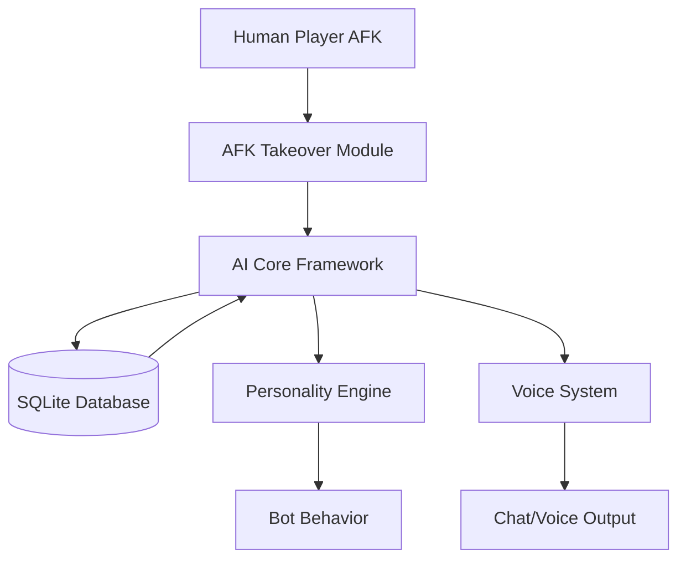

# CubeNet AI Squad

**CubeNet AI Squad** is a professional-grade, modular AI framework for Team Fortress 2 dedicated servers. Built on SourceMod and SourcePawn, it shifts the paradigm of TF2 bots from disposable gameplay fillers to persistent, evolving digital teammates.

## 👁️ The Vision

Traditional TF2 bots are ephemeral; they spawn, fight, and vanish without a trace. CubeNet AI Squad asks: *What happens when an AI has a history?*

Our goal is to create a living AI ecosystem where bots possess permanent identities, distinct personalities, and long-term memory. By tracking statistics and behavior across sessions, we transform the "empty server" experience into a community atmosphere where AI teammates have recognizable strengths, weaknesses, and unique playstyles.

---

## 🛠️ Core Pillars

### 🆔 Persistent Identity & Evolution
Unlike standard bots, every CubeNet entity is tied to a permanent profile stored in SQLite. This allows for:
*   **Long-term Statistics:** Tracking kills, deaths, and objective contributions across server restarts.
*   **Progression:** The foundation for AI that "learns" or evolves based on its performance history.
*   **Consistency:** Bots retain their names and traits, becoming familiar faces to the human players on the server.

### 🎭 Personality Engine
We move beyond binary "difficulty" settings. Our framework allows for configurable behavior traits—such as aggression, risk tolerance, and objective focus—ensuring that no two AI teammates feel identical in a match.

### 🗣️ Dynamic Communication
The Voice System integrates event-driven dialogue. From spawn announcements to reaction-based kill responses, the communication layer is designed to make the AI feel integrated into the social fabric of the game.

### 🔄 Seamless AFK Integration
To maintain match momentum without disrupting the player experience, our AFK Takeover system intelligently replaces inactive humans with AI counterparts, managing team balance and player state via a non-destructive spectator-swap pipeline.

---

## 📐 System Architecture

CubeNet AI Squad utilizes a **Core-and-Satellite** architecture. The `AI Core` handles the heavy lifting of identity management and database I/O, while specialized modules handle specific behaviors.

*For a deep dive into the technical implementation, see the [Architecture Documentation](docs/architecture.md).*

---

## 🚀 Quick Start

### Requirements
*   **TF2 Dedicated Server**
*   **SourceMod 1.11+**
*   **SourcePawn Compiler**

### Installation
1.  **Compile:** Build the `.sp` plugins located in `/src`.
2.  **Deploy Plugins:** Move compiled `.smx` files to `addons/sourcemod/plugins/`.
3.  **Deploy Configs:** Place configuration files in `addons/sourcemod/configs/`.
4.  **Load Order:** Ensure `cubenet_ai_core` loads before the Voice and AFK modules.

👉 [Detailed Installation Guide](docs/INSTALL.md)

---

## 🗺️ Strategic Roadmap

| Phase | Focus | Key Deliverables | Status |
| :--- | :--- | :--- | :--- |
| **v4.x** | **Foundation** | Modular layout, Shared API, Core framework | ✅ Complete |
| **v4.x** | **Persistence** | SQLite integration, Profile loading, Stats tracking | 🏗️ In Progress |
| **v5.x** | **Personality** | Decision weighting, Individual playstyles | 📅 Planned |
| **v6.x** | **Intelligence** | Squad coordination, Tactical objective planning | 📅 Planned |

---

## 📚 Documentation

| Document | Description |
| :--- | :--- |
| [Architecture](docs/architecture.md) | System design and data flow diagrams. |
| [Database](docs/database.md) | SQLite schema and persistence logic. |
| [Personalities](docs/personalities.md) | The logic behind AI behavior traits. |
| [Voice System](docs/voice-system.md) | Communication event framework. |
| [AFK System](docs/afk-system.md) | Player replacement pipeline. |
| [Roadmap](docs/roadmap.md) | Long-term development vision. |

---

## 🤝 Contributing

We welcome contributions from the SourceMod community. Whether you are a SourcePawn expert or a TF2 tester, your help is valued. Please review our [Contributing Guidelines](CONTRIBUTING.md) before submitting a PR.

**License:** MIT  
**Created For:** [CubeNet Game Servers]
